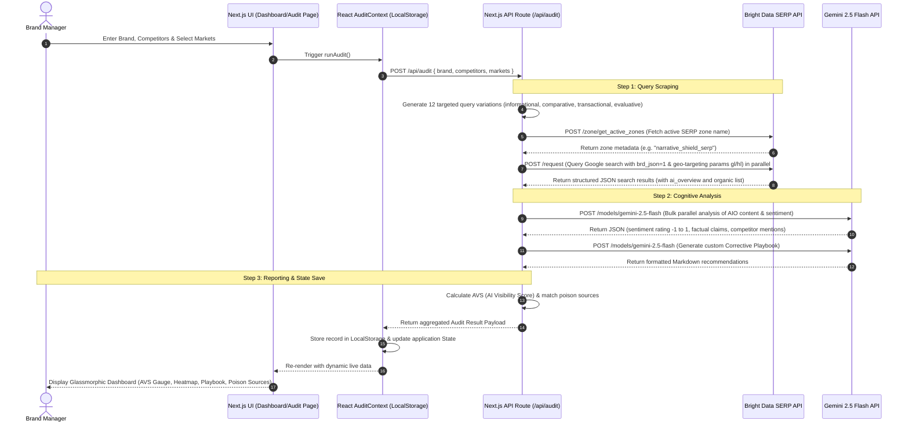

# NarrativeShield™ — AI Search Visibility & Narrative Intelligence

NarrativeShield is a state-of-the-art brand intelligence and reputation protection platform. Designed for modern PR, SEO, and brand management, NarrativeShield provides continuous visibility into what generative AI search engines (like Google AI Overviews, Perplexity, etc.) tell users about your brand. By auditing search engine result pages (SERPs) across geographies and languages, it automatically flags "poison sources" (outdated, competitor-biased, or inaccurate content) and generates prioritized playbooks to correct and shape your AI-generated brand narrative.

Built for the **Bright Data Web Intelligence Hackathon 2026**.

---

## 🗺️ System Data Flow & Architecture

The following diagram illustrates how NarrativeShield orchestrates requests between the React frontend, the Next.js API route, the Bright Data scraping infrastructure, and the Google Gemini cognitive layer:



---

## 🌟 Key Technical Modules

### 1. AI Narrative Audit Engine (`/api/audit`)
* **Dynamic Query Generator (`src/lib/queries.ts`)**: Dynamically compiles search terms targeting different search intents:
  - *Informational*: "What is [Brand]?" / "How does [Brand] work?"
  - *Comparative*: "[Brand] vs [Competitor]"
  - *Evaluative*: "[Brand] customer experience" / "[Brand] reviews 2026"
  - *Transactional*: "Is [Brand] worth it?" / "Buy [Brand]"
* **Market Orchestrator**: Multi-geography support (US, Germany, Japan, Brazil, United Kingdom, Singapore, India, Indonesia) translating selections into regional parameters (`gl` and `hl` values).
* **Parallel Requesting**: Uses `Promise.all` to query all SERP instances simultaneously for low-latency response (~15-20 seconds total audit time).

### 2. Bright Data SERP & Zone API Integration (`src/lib/brightdata.ts`)
* **Dynamic Zone Discovery**: Queries `https://api.brightdata.com/zone/get_active_zones` to search for active zones of type `serp` (e.g., `narrative_shield_serp`). If none is configured, it safely defaults to `narrative_shield_serp`.
* **Synchronous POST SERP Scraping**: Uses `https://api.brightdata.com/request` with proxy credentials. Appends `&brd_json=1` and sets `"format": "raw"` to force Google to return structured search results.
* **Deep Parsing of AI Overviews**: Parses complex layout structures returned by Google's SGE (Search Generative Experience), including:
  - Direct paragraphs
  - Bulleted lists (deconstructing nested text blocks)
  - References and citations (extracting title, URL, and hostname)

### 3. Cognitive Layer: Google Gemini (`src/lib/gemini.ts`)
* **Parallel Sentiment & Claim Analysis**: Calls the super-fast **`gemini-2.5-flash`** model with structural JSON schema guidelines:
  - Extracts exact sentiment values (`-1.0` to `+1.0`)
  - Pinpoints specific claims made about the brand
  - Notes competitor visibility in the overview
* **Markdown Code Block Stripper**: Cleverly cleans Gemini's output by removing markdown backticks (````json ... ````) before executing `JSON.parse` to ensure 100% parse stability.
* **Playbook Generator**: Synthesizes the overall brand visibility, parsed sentiments, and poison sources to generate a step-by-step Action Playbook.

### 4. AVS (AI Visibility Score) Algorithm (`src/lib/avs.ts`)
AVS represents a brand's health and share of visibility across AI results. It is computed as a weighted sum of four pillars:
$$\text{AVS} = (0.35 \times \text{Presence Rate}) + (0.30 \times \text{Sentiment Score}) + (0.25 \times \text{Share of Voice}) + (0.10 \times \text{Geographic Parity})$$

- **Presence Rate (35%)**: Proportion of queries that trigger an AI Overview.
- **Sentiment Score (30%)**: Scaled average sentiment from Gemini analysis (mapped from $[-1, +1]$ to $[0, 100]$).
- **Share of Voice (25%)**: Ratio of brand mentions in the AIO vs. competitor mentions.
- **Geographic Parity (10%)**: Standard deviation of sentiments across regional markets (brands with consistent positive sentiment globally score highest).

### 5. Premium UI Design & Micro-Animations
* **Theme System**: Custom styling system in `globals.css` using custom HSL colors (`--lime`, `--midnight`, `--amethyst`, `--sunset`, `--danger`).
* **Glassmorphic Cards**: Pure vanilla CSS glassmorphism utilising `backdrop-filter: blur()`, transluscent borders (`rgba(255,255,255,0.08)`), and noisy gradient background grids.
* **Interactive Heatmaps**: Intent vs Geography sentiment matrix where cells represent AIO sentiment values. Clicking on cells instantly displays the underlying cited sources and AI text snippet.
* **GSAP Animation hooks**: Screen transitions, stagger animations, progress animations, and count-up values hook into scroll triggers for a state-of-the-art interactive experience.

---

## 🛠️ Environment Configuration

Create a `.env.local` file in the root of this app (`/narrative-shield-app`):

```env
# Google Gemini API Key
GOOGLE_GEMINI_API_KEY="YOUR API KEY HERE"

# Bright Data API Key
BRIGHT_DATA_API_KEY="YOUR API KEY HERE"
```

*Make sure your Bright Data API Key has permissions to read Zone metadata and trigger SERP requests.*

---

## 🚀 Running the App Locally

### 1. Installation
Install all required Node modules:
```bash
npm install
```

### 2. Run the Dev Server
Launch the development server:
```bash
npm run dev
```
Open [http://localhost:3000](http://localhost:3000) in your browser.

### 3. Build & Production Check
Verify TypeScript typechecking, code linting, and Next.js static asset optimizations:
```bash
npm run build
```

---

## 📋 API Endpoint Documentation

### `POST /api/audit`
Initiates a live multi-market scan using Bright Data and Gemini.

**Request Body:**
```json
{
  "brand": "NexaFin",
  "competitors": ["FinGuard Pro", "SecureFlow"],
  "markets": ["US", "DE", "JP", "ID"]
}
```

**Response Sample:**
```json
{
  "success": true,
  "brand": "NexaFin",
  "competitors": ["FinGuard Pro", "SecureFlow"],
  "markets": ["US", "DE", "JP", "ID"],
  "queries": [
    {
      "id": "q-0",
      "query": "What is NexaFin?",
      "intent": "informational",
      "market": "US",
      "language": "en",
      "hasAIOverview": true,
      "sentiment": 0.4,
      "claims": ["NexaFin provides digital asset banking", "Low fees on international transfers"],
      "competitorsMentioned": [],
      "sourceUrls": ["https://techcrunch.com/..."],
      "aiOverviewContent": "NexaFin is a digital banking platform..."
    }
  ],
  "poisonSources": [
    {
      "id": "ps-0",
      "url": "https://reddit.com/r/fintech/...",
      "title": "Source from reddit.com",
      "domain": "reddit.com",
      "biasType": "forum_noise",
      "accuracyScore": 50,
      "impactScore": 60,
      "fixabilityScore": 80,
      "recommendation": "Address criticism directly by updating official FAQs."
    }
  ],
  "avs": {
    "overall": 68,
    "presenceRate": 75,
    "sentimentScore": 70,
    "shareOfVoice": 65,
    "geographicParity": 60
  },
  "stats": {
    "totalQueries": 12,
    "marketsScanned": 4,
    "languagesUsed": 1,
    "aiOverviewsFound": 9,
    "aiOverviewRate": 75,
    "avgSentiment": 0.35,
    "poisonSourcesFound": 1,
    "lastAuditTime": "2026-05-26T13:00:00Z",
    "auditDurationSeconds": 14
  },
  "timestamp": "2026-05-26T13:00:00Z"
}
```

---

## 🛡️ History & State Management (`src/context/AuditContext.tsx`)

NarrativeShield doesn't require a dedicated relational database setup for local hackathon evaluation. Instead, it utilizes a client-side database layer synchronized with `localStorage`:

- **Active Audit (`narrative_shield_active_id`)**: Stores the ID of the current active brand audit being viewed.
- **Audit Records (`narrative_shield_history`)**: Stores an array of historical audit JSON data. When a user runs a live audit, the context:
  1. Calls `/api/audit`
  2. Overwrites or appends the brand record in the local array
  3. Saves the array to `localStorage`
  4. Triggers React state updates to re-render the dashboard in real-time
- **Persistence**: Refreshes and tab changes will not wipe out tracked audits, ensuring a realistic SaaS simulation.
